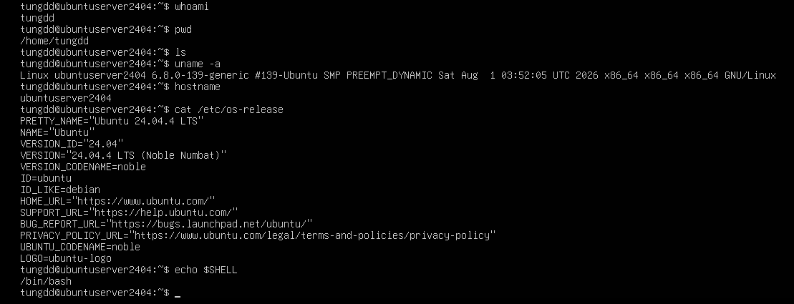
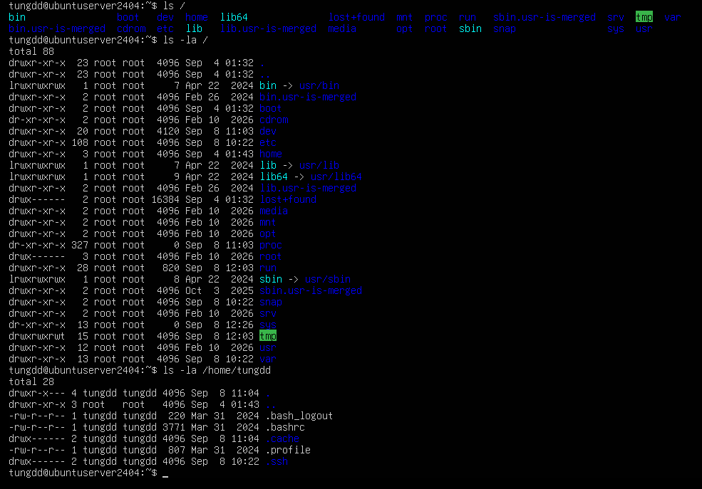
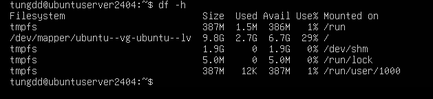
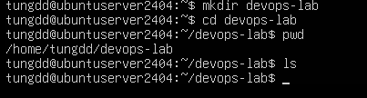

# Linux Basic Lab – Ubuntu Server 24.04

> **Mục tiêu:** Làm quen với môi trường Linux/Ubuntu Server, Terminal, Shell và Linux Filesystem thông qua thực hành trực tiếp trên máy Ubuntu Server 24.04.

---

## 1. Thông tin môi trường thực hành

Các lệnh được thực hiện trực tiếp trên Ubuntu Server.

| Thành phần | Kết quả |
|---|---|
| User | `tungdd` |
| Hostname | `ubuntuserver2404` |
| Operating System | Ubuntu 24.04.4 LTS |
| Codename | Noble Numbat (`noble`) |
| Kernel | `6.8.0-139-generic` |
| Architecture | `x86_64` |
| Shell | `/bin/bash` |
| Home Directory | `/home/tungdd` |

---

# 2. Linux Basic

## 2.1. Kiểm tra user hiện tại

### Command

```bash
whoami
```

### Kết quả thực tế

```text
tungdd
```

### Nhận xét

Lệnh `whoami` cho biết user hiện tại đang đăng nhập và thực thi các câu lệnh trên hệ thống.

## 2.2. Kiểm tra thư mục hiện tại

### Command

```bash
pwd
```

### Kết quả thực tế

```text
/home/tungdd
```

### Nhận xét

`pwd` là viết tắt của **Print Working Directory**, dùng để xác định vị trí hiện tại trong Linux Filesystem.

Thư mục `/home/tungdd` là Home Directory của user `tungdd`.

---

## 2.3. Liệt kê nội dung thư mục

### Command

```bash
ls
```

### Kết quả

Tại thời điểm thực hành, thư mục Home không có nội dung hiển thị bằng lệnh `ls`.

### Nhận xét

`ls` dùng để liệt kê file và directory trong thư mục hiện tại.

Để xem cả file ẩn và thông tin chi tiết có thể sử dụng:

```bash
ls -la
```

---

# 3. Kiểm tra hệ điều hành và Kernel

## 3.1. Kiểm tra Kernel

### Command

```bash
uname -a
```

### Kết quả thực tế

```text
Linux ubuntu 6.8.0-139-generic #139-Ubuntu SMP PREEMPT_DYNAMIC Sat Aug 1 03:52:05 UTC 2026 x86_64 x86_64 x86_64 GNU/Linux
```

### Phân tích

Một số thông tin quan trọng:

- `Linux`: Linux Kernel đang được sử dụng.
- `6.8.0-139-generic`: phiên bản Kernel.
- `x86_64`: kiến trúc hệ thống 64-bit.
- `GNU/Linux`: môi trường Linux sử dụng GNU utilities.

### Ý nghĩa đối với DevOps

Kernel là thành phần cốt lõi nằm giữa phần cứng và các chương trình chạy trên hệ điều hành.

Hiểu thông tin Kernel giúp xác định môi trường khi troubleshooting, kiểm tra compatibility và quản trị server.

---

# 4. Ubuntu Server 24.04

## 4.1. Kiểm tra phiên bản Ubuntu

### Command

```bash
cat /etc/os-release
```

### Kết quả thực tế

```text
PRETTY_NAME="Ubuntu 24.04.4 LTS"
NAME="Ubuntu"
VERSION_ID="24.04"
VERSION="24.04.4 LTS (Noble Numbat)"
VERSION_CODENAME=noble
ID=ubuntu
ID_LIKE=debian
```

### Nhận xét

Máy thực hành đang sử dụng:

**Ubuntu 24.04.4 LTS – Noble Numbat**

`VERSION_ID="24.04"` xác định dòng Ubuntu 24.04.

Ubuntu thuộc họ Debian, thể hiện qua:

```text
ID_LIKE=debian
```

Điều này cũng liên quan đến việc sử dụng hệ thống quản lý package `apt`.

---

# 5. Terminal và Shell

## 5.1. Kiểm tra Shell

### Command

```bash
echo $SHELL
```

### Kết quả thực tế

```text
/bin/bash
```

### Nhận xét

Shell hiện tại là **Bash**.

Có thể hình dung quá trình làm việc:

```text
User
  ↓
Terminal
  ↓
Bash Shell
  ↓
Linux Kernel
  ↓
Hardware
```

Terminal là giao diện để người dùng tương tác với hệ thống.

Shell là chương trình tiếp nhận và xử lý các câu lệnh người dùng nhập vào.

---

## Minh chứng thực hành

Ảnh dưới đây là kết quả thực hành các lệnh Linux Basic và kiểm tra Filesystem trên Ubuntu Server 24.04.



# 6. Linux Filesystem

## 6.1. Kiểm tra Root Directory

### Command

```bash
ls /
```

### Kết quả thực tế

Hệ thống hiển thị các thư mục chính như:

```text
bin
boot
dev
etc
home
lib
lib64
media
mnt
opt
proc
root
run
sbin
snap
srv
sys
tmp
usr
var
```

### Cấu trúc tổng quát

```text
/
├── bin
├── boot
├── dev
├── etc
├── home
│   └── tungdd
├── lib
├── lib64
├── media
├── mnt
├── opt
├── proc
├── root
├── run
├── sbin
├── snap
├── srv
├── sys
├── tmp
├── usr
└── var
```

`/` là **Root Directory**, tức thư mục gốc của Linux Filesystem.

> Lưu ý: `/` và `/root` là hai khái niệm khác nhau. `/` là thư mục gốc của toàn bộ filesystem, còn `/root` là Home Directory của user `root`.

---

# 7. Các thư mục quan trọng

## `/home`

Chứa Home Directory của các user thông thường.

Trong môi trường thực hành:

```text
/home/tungdd
```

là Home Directory của user `tungdd`.

---

## `/etc`

Chứa nhiều file cấu hình của hệ thống và các dịch vụ.

Ví dụ:

```text
/etc/os-release
/etc/ssh/
/etc/hosts
```

Trong bài thực hành, file:

```text
/etc/os-release
```

được sử dụng để kiểm tra phiên bản Ubuntu.

Đây là một thư mục đặc biệt quan trọng đối với Linux System Administration và DevOps.

---

## `/var`

Chứa dữ liệu thường xuyên thay đổi trong quá trình hệ thống và ứng dụng hoạt động.

Một khu vực quan trọng:

```text
/var/log
```

dùng để lưu nhiều loại log.

---

## `/var/log`

Trong bài thực hành đã kiểm tra:

```bash
ls -la /var/log | head
```

Một số nội dung quan sát được:

```text
alternatives.log
apparmor
auth.log
bootstrap.log
btmp
cloud-init.log
```

### Ý nghĩa

- `auth.log`: liên quan đến hoạt động xác thực.
- `cloud-init.log`: log của cloud-init, thường gặp trong quá trình khởi tạo server.
- Các log khác phục vụ việc theo dõi hoạt động của hệ thống và dịch vụ.

Phần Logs sẽ được tìm hiểu sâu hơn ở bài học sau.

---

## `/tmp`

Chứa các dữ liệu tạm thời của hệ thống và ứng dụng.

Không nên tùy tiện xóa toàn bộ nội dung `/tmp` khi chưa hiểu rõ tác động.

---

## `/usr`

Chứa nhiều chương trình, thư viện và dữ liệu phục vụ hệ thống.

Một số thư mục thường gặp:

```text
/usr/bin
/usr/sbin
/usr/lib
```

---

## `/opt`

Thường được sử dụng cho các phần mềm hoặc ứng dụng bổ sung được cài đặt theo cách riêng.

---

## `/boot`

Chứa các thành phần cần thiết cho quá trình boot hệ thống, bao gồm các file liên quan đến Linux Kernel và bootloader.

---

## `/dev`

Chứa các device files đại diện cho thiết bị và một số interface đặc biệt của hệ thống.

Ví dụ:

```text
/dev/null
/dev/random
```

---

## `/proc`

Filesystem đặc biệt cung cấp thông tin liên quan đến process và Kernel.

Ví dụ:

```bash
cat /proc/cpuinfo
cat /proc/meminfo
```

---

## `/sys`

Cung cấp interface và thông tin liên quan đến Kernel, thiết bị và hệ thống.

---

# 8. `ls -la` và thông tin file

Đã sử dụng:

```bash
ls -la /home/tungdd
```

Kết quả cho thấy các file/thư mục ẩn như:

```text
.bash_logout
.bashrc
.cache
.profile
.ssh
```

Ví dụ:

```text
-rw-r--r-- 1 tungdd tungdd 3771 ... .bashrc
```

Có thể nhận biết:

```text
-rw-r--r--   tungdd   tungdd
│            │        │
│            │        └── Group
│            └─────────── Owner
└──────────────────────── Permission
```

Ảnh dưới đây là kết quả thực hành các lệnh Linux Basic và kiểm tra Filesystem trên Ubuntu Server 24.04.




# 9. `df -h` – kiểm tra dung lượng Filesystem

### Command

```bash
df -h
```

Trong kết quả thực hành, filesystem chính được mount tại `/`:

```text
/dev/mapper/ubuntu--vg-ubuntu--lv
```

với thông tin quan sát được:

```text
Size   Used   Avail   Use%   Mounted on
9.8G   2.6G   6.7G    29%    /
```

### Nhận xét

- `Size`: tổng dung lượng filesystem.
- `Used`: dung lượng đã sử dụng.
- `Avail`: dung lượng còn khả dụng.
- `Use%`: phần trăm dung lượng đã sử dụng.
- `Mounted on`: vị trí filesystem được mount.

Máy cũng hiển thị các filesystem dạng `tmpfs`, được sử dụng cho một số vùng dữ liệu tạm thời trong hệ thống.

---

Ảnh dưới đây là kết quả thực hành các lệnh Linux Basic và kiểm tra Filesystem trên Ubuntu Server 24.04.



---


# 10. `du -sh` – kiểm tra dung lượng Directory

### Command

```bash
du -sh /home/tungdd
```

### Kết quả thực tế

```text
24K    /home/tungdd
```

### Phân tích

- `du`: Disk Usage.
- `-s`: Summary, chỉ hiển thị tổng.
- `-h`: Human-readable.

Kết quả cho thấy `/home/tungdd` đang sử dụng khoảng **24 KB** tại thời điểm thực hành.

---

Ảnh dưới đây là kết quả thực hành các lệnh Linux Basic và kiểm tra Filesystem trên Ubuntu Server 24.04.


---

# 11. Phân biệt `df` và `du`

Đây là kiến thức quan trọng khi quản trị Linux Server.

```text
df → Filesystem
du → File / Directory
```

### `df`

```bash
df -h
```

Trả lời câu hỏi:

> Filesystem còn bao nhiêu dung lượng?

### `du`

```bash
du -sh /home/tungdd
```

Trả lời câu hỏi:

> Directory hoặc file đang chiếm bao nhiêu dung lượng?

Trong thực tế DevOps, hai lệnh này rất hữu ích khi server có vấn đề **full disk**.

---

# 12. Tổng kết kiến thức đã thực hành

Đã thực hành và kiểm tra:

```text
Linux Basic
    ↓
Ubuntu Server 24.04       ✅
    ↓
Terminal                   ✅
    ↓
Shell / Bash               ✅
    ↓
Filesystem                 ✅
    ↓
File & Directory           ⏳
    ↓
Permission                 ⏳
    ↓
Process                    ⏳
    ↓
Package                    ⏳
    ↓
Service                    ⏳
    ↓
Network                    ⏳
    ↓
Logs                       ⏳
```

## Kiến thức đã nắm được

- Xác định user hiện tại bằng `whoami`.
- Xác định thư mục hiện tại bằng `pwd`.
- Liệt kê file và directory bằng `ls`.
- Kiểm tra Kernel bằng `uname`.
- Kiểm tra hostname bằng `hostname`.
- Kiểm tra phiên bản Ubuntu bằng `/etc/os-release`.
- Xác định Shell hiện tại bằng `$SHELL`.
- Hiểu `/` là Root Directory.
- Nhận biết vai trò cơ bản của `/home`, `/etc`, `/var`, `/var/log`, `/tmp`, `/usr`, `/opt`, `/boot`, `/dev`, `/proc`, `/sys`.
- Sử dụng `ls -la` để quan sát owner, group và permission.
- Kiểm tra dung lượng filesystem bằng `df -h`.
- Kiểm tra dung lượng directory bằng `du -sh`.
- Bắt đầu làm quen với cấu trúc Linux Server thực tế.

# 13. File & Directory

## 13.1. Tạo thư mục thực hành

### Command

```bash
mkdir devops-lab
cd devops-lab
```

### Nhận xét

Lệnh `mkdir` dùng để tạo một hoặc nhiều thư mục mới từ cửa sổ dòng lệnh.



## 13.2. Tạo nhiều thư mục

### Command

```bash
mkdir app logs backup
```

### Kết quả thực tế

```text
app logs backup
```

### Nhận xét

Lệnh `mkdir` dùng để tạo một hoặc nhiều thư mục mới từ cửa sổ dòng lệnh.


## 13.3. Tạo File

### Command

```bash
touch app/app.log
touch app/config.txt
touch logs/system.log
ls app
```

### Kết quả thực tế

```text
app.log cconfig.txt
```

### Nhận xét

Lệnh `touch` dùng để tạo file trống mới hoặc cập nhật thời gian truy cập và chỉnh sửa của file sẵn có

## 13.4. Ghi dữ liệu vào / Đọc file

### Command

```bash
echo "Hello DevOps" > app/config.txt
echo "Second line" >> app/config.txt
cat app/config.txt
```

### Kết quả thực tế

```text
Hello DevOps
Second liine
```


## 13.5. Copy file

### Command

```bash
cp app/config.txt backup/
```

### Nhận xét

Lệnh `cp` dùng để sao chép tệp tin và thư mục từ vị trí này sang vị trí khác.

## 13.6. Di chuyển / đổi tên file

### Command

```bash
mv app/config.txt app/config-prod.txt
ls app
```

### Kết quả thực tế

```text
app.log
config-prod.txt
```

### Nhận xét

Lệnh `mv` dùng để di chuyển hoặc đổi tên tệp (file) và thư mục (folder)

## 13.7. Xóa file

### Command

```bash
rm logs/system.log
ls logs
```

### Kết quả thực tế

```text

```

### Nhận xét

Lệnh `rm` dùng để xóa các tệp tin và thư mục từ dòng lệnh


